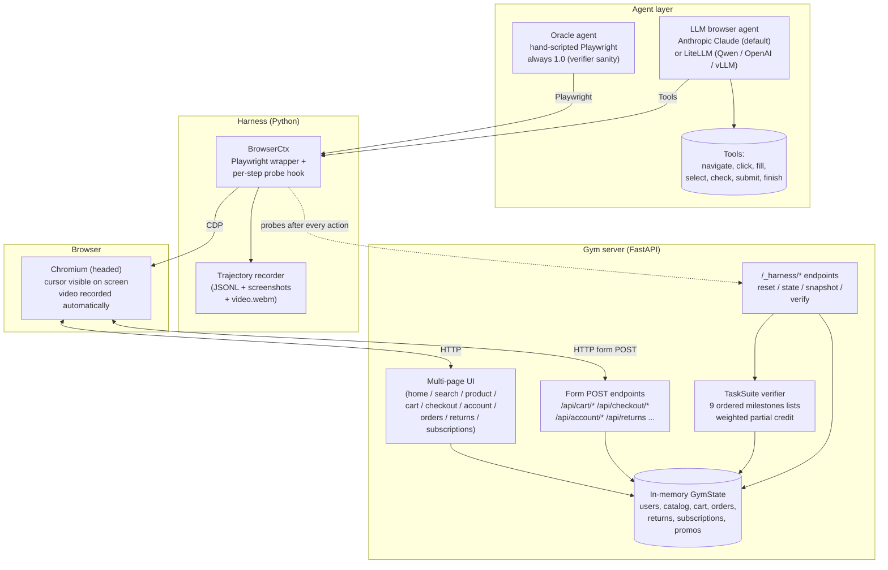
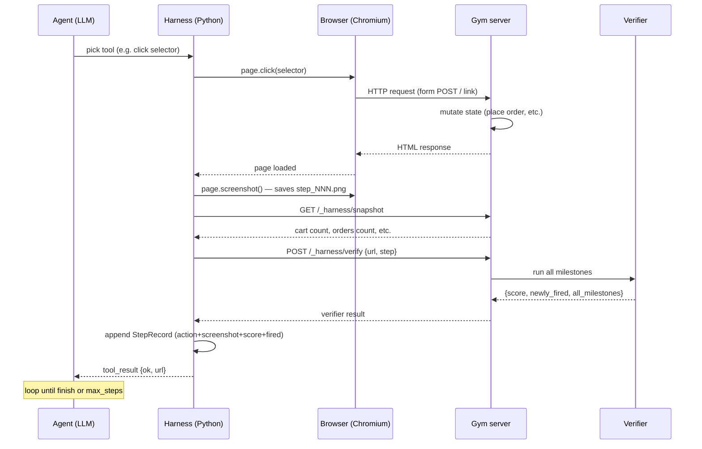

# DESIGN — ecommerce-browser-gym

> A production-grade browser-agent RL gym for e-commerce. Real Chromium,
> real clicks, multi-step tasks, per-step milestone rewards, multi-level
> verifier inspection (DOM + URL + backend state).

## 1. Goal

Build a UI gym in the shape of WebArena / VisualWebArena / TauBench
but with the closed-loop benefits of an in-house simulator: agents
operate a real browser, but the harness can also inspect ground-truth
backend state for verification.

This is the kind of gym frontier labs and enterprise customers use to
benchmark browser agents — Browser Use, Anthropic Claude Computer Use,
OpenAI Operator/CUA, ACI Stagehand. Same gym tests all of them with one
swap-the-agent flag.

## 2. Architecture



### One-step sequence



## 3. Why a milestone-based verifier?

The standard pattern in WebArena / VisualWebArena is final-state-only:
"did an order get placed correctly?" → 1 or 0. The downsides:

1. **Sparse reward** — RL training needs dense gradient signal.
2. **No partial credit** — half-correct attempts get the same 0 as
   nothing-attempted.
3. **No diagnostics** — when an agent fails, you can't tell *where* it
   went wrong.

Milestone-based grading fixes all three:

- Each task = ordered list of **milestones**, each with a weight.
- After every agent action, harness probes each milestone — if any
  newly fires, it's marked at this step.
- Final score = sum of weighted fired milestones / total weight.
- Trajectory JSONL records which milestone fired at which step → exact
  diagnostic.

Where milestone checks look:
- **URL** — "did the agent navigate to `/checkout/review`?"
- **DOM state** — "is the right element visible?"
- **Backend ground truth** — "did the order get created with the right
  items / address / payment / coupon?"

This is **what production browser-agent gyms look like at scale**
(TauBench's programmable verifiers are similar in spirit).

## 4. Domain model — entities

| Entity | Fields |
|---|---|
| `Product` | id, name, brand, category, base_price, rating, stock, image_emoji, description, tags, variants[], reviews[], is_subscribable |
| `ProductVariant` | id, label, attributes, price_delta, stock |
| `User` | id, email, password, full_name, addresses{}, payment_methods{}, two_fa_enabled, loyalty_tier |
| `Address` | id, label, line1, line2, city, state, zip, is_default |
| `PaymentMethod` | id, label, kind, expires, nickname, is_default |
| `Coupon` | code, name, description, discount_pct, discount_flat, applies_to_category, applies_to_product_id, min_purchase, expired |
| `CartItem` | id, product_id, variant_id, quantity, gift_wrap, gift_message, ship_to_address_id, scheduled_delivery |
| `Order` | id, user_id, items[], subtotal, discount, tax, shipping, total, promo_code, payment_id, status, shipments[] |
| `Shipment` | id, tracking_number, carrier, item_ids[], status, estimated_delivery, events[] |
| `ReturnRequest` | id, order_id, user_id, item_ids[], reason, refund_method, status, notes |
| `Subscription` | id, user_id, product_id, cadence, deliveries_remaining, next_delivery_date, address_id, payment_id, loyalty_discount_pct |

This is **much richer** than a typical toy e-commerce model. It supports
the kinds of journeys a real shop runs.

## 5. The 9 tasks

3 categories × 3 difficulty tiers = 9. See [`TASKS.md`](./TASKS.md) for
the full per-task milestone tables.

| ID | Category | Diff | Key challenges tested |
|---|---|---|---|
| A1 | Discovery | easy | Read brief carefully (distractor product); full happy-path |
| A2 | Discovery | medium | Filter combinations + decisioning under constraints |
| A3 | Discovery | hard | Variant picker + multi-item bundle + budget |
| B1 | Mgmt | easy | Multi-field form + setting default |
| B2 | Mgmt | medium | Modal popup + return form with item selection + reason + refund method |
| B3 | Mgmt | hard | Three independent changes in one session |
| C1 | Checkout | medium | Promo with category restriction (partial-cart applicability) |
| C2 | Checkout | medium | Per-line options: gift wrap, message, split shipping |
| C3 | Checkout | hard | Subscription with cadence + loyalty discount inference |

## 6. Failure modes — what the gym tests

Each verifier suite uses the 12-category taxonomy implicitly through
milestone-firing patterns:

- **No order placed** → many milestones never fire → low score
- **Wrong product** → "ordered_target" never fires → ~0.3 cap
- **Over budget** → state milestone passes but programmable budget check
  doesn't → ~0.7 cap
- **Wrong coupon** → missing_coupon milestone never fires AND
  no_wrong_coupon_used is hard-fail → score 0
- **Forgot a step** → that milestone never fires, others do → exact
  partial credit
- **Sequence violation** → trajectory-pattern milestone doesn't fire
  even though state milestones do

## 7. The 3 agent types this gym tests

The same harness drives all three:

### Oracle agent (Playwright + Python)
Hand-coded gold trajectory per task. Always scores 1.0 if the verifier
is correctly designed. Used to validate verifiers and as a reference
ceiling.

### DOM-action LLM agent (default)
Each turn: dump interactables → LLM picks one action (click / fill /
select / etc.) → translate to Playwright. Works against:
- Anthropic Claude (native `tool_use`)
- LiteLLM (Together AI, OpenRouter, OpenAI, self-hosted vLLM)

### Pixel-level agent (future)
Same `BrowserCtx` supports screenshots — swap the agent loop and you
get Anthropic Computer Use / OpenAI CUA. Not implemented in this cut.

## 8. Trajectory format

Every episode produces a JSONL with:

```jsonc
{
  "episode_id": "abc12345",
  "task_id": "A1/buy_wireless_mouse",
  "seed": 0,
  "agent_name": "llm[claude-sonnet-4-5-20250929]",
  "task_brief": "...",
  "task_category": "A", "task_difficulty": "easy",
  "started_at": 1762830000.123,
  "finished_at": 1762830042.456,
  "initial_url": "http://localhost:8000/",
  "initial_snapshot": {...},
  "steps": [
    {
      "step_idx": 0,
      "action_kind": "navigate",
      "action_args": {"path": "/product/p_mouse_wireless"},
      "url_after": "http://localhost:8000/product/p_mouse_wireless",
      "screenshot_path": "screenshots/.../step_000.png",
      "milestones_fired_this_step": ["viewed_product_page"],
      "running_score": 0.15,
      "snapshot_after": {...},
      "reasoning": "Looking for the Wireless Mouse..."
    },
    /* ... */
  ],
  "final_url": "http://localhost:8000/order/ORD-...",
  "final_snapshot": {...},
  "verifier_result": {
    "score": 1.0, "success": true,
    "all_milestones": [
      {"name": "viewed_product_page", "weight": 0.15,
       "fired_at_step": 0, "required": false},
      /* ... */
    ]
  },
  "video_path": "videos/llm/abc.webm"
}
```

Every action carries: what happened (selector + args), where the
browser ended up (URL), what milestone(s) fired *this step*, and the
running score. This is **dense reward signal**.

## 9. Pytest test suite (37 tests)

Production gyms ship with tests:

- **`test_mutations.py` (17 tests)** — invariants of state mutations:
  cart math correct, coupon validation rules, place_order
  preconditions, inventory decrement, 2FA enable, subscription
  creation with loyalty inference.
- **`test_verifiers.py` (20 tests)** — for each of 9 tasks, simulate
  a successful run and assert score=1.0; for failure modes, assert
  partial credit / specific missed milestone.

`pytest -v` → all 37 pass in <1 second.

## 10. Out of scope (known production gaps)

- **Real product images** — emojis as placeholders (image rendering not
  needed for milestone grading)
- **Pixel-level (Computer Use) agent** — DOM-action only here; same
  harness supports adding it
- **Multi-tenant** — one episode at a time per server
- **Database persistence** — in-memory state
- **Auth, rate limiting, observability/metrics** — production concerns
- **Real promos/inventory updates between episodes** — each reset is a
  clean snapshot

## 11. How this fits the larger picture

If you wrap the verifier as a TRL reward function and replace the
oracle agent with a model under training, this gym becomes a training
substrate (same RLVR pattern from Tülu 3 / DeepSeek-R1 — verifiable
rewards, no human in the loop). The browser is the data factory; the
trajectories are the data.
